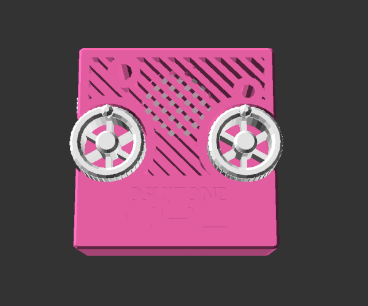

# APC

A decapitated robot head? An extraterrestrial communicator? A specter summoner?

Nope (and yep!), it's an [APC](https://en.wikipedia.org/wiki/Atari_Punk_Console)!

## Assembly

### BOM

| Designator  | Package                                           | Quantity | Designation |
| ----------- | ------------------------------------------------- | -------- | ----------- |
| RV101,RV102 | Potentiometer_Bourns_PTV09A-1_Single_Vertical     | 2        | 500k-1M     |
| LS101       | Speaker_30mm_36MS30008-PN                         | 1        | Speaker     |
| C103        | CP_Radial_D4.0mm_P2.00mm                          | 1        | 10uF        |
| U101        | DIP-14_W7.62mm_LongPads                           | 1        | LM556       |
| S101        | SW_Slide_1P2T_CK_OS102011MS2Q                     | 2        | EG1218      |
| RV103       | Potentiometer_Piher_PT-6-V_Vertical               | 1        | 5k          |
| D101        | LED_D5.0mm                                        | 1        | LED         |
| C102        | C_Disc_D5.0mm_W2.5mm_P5.00mm                      | 1        | .1uF        |
| C101        | C_Disc_D5.0mm_W2.5mm_P5.00mm                      | 1        | .01uF       |
| BT101       | PinHeader_1x02_P2.54mm_Vertical                   | 1        | 9v          |
| R101        | R_Axial_DIN0207_L6.3mm_D2.5mm_P10.16mm_Horizontal | 1        | 330         |
| R102        | R_Axial_DIN0207_L6.3mm_D2.5mm_P10.16mm_Horizontal | 1        | 1k          |

### Schematic

PCB and its schematic are actually part of [poly555](https://github.com/oskitone/poly555), which explains why component numbers start at 100.

## OpenSCAD

### Dependencies

Assumes poly555 repo is in a sibling directory. Here's how I've got it:

    \ oskitone
        \ apc
        \ poly555

## License

Designed by Oskitone. Please support future synth projects by purchasing from [Oskitone](https://www.oskitone.com/).

Creative Commons Attribution/Share-Alike, all text above must be included in any redistribution. See license.txt for additional details.
