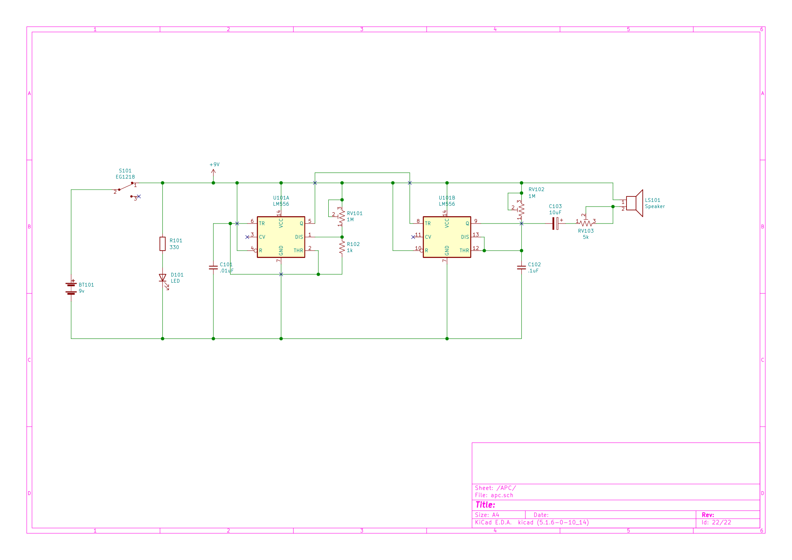

# APC

A decapitated robot head? An extraterrestrial communicator? A specter summoner?

Nope (and yep!), it's an [APC](https://en.wikipedia.org/wiki/Atari_Punk_Console)!

**Demo:** [https://vimeo.com/518375593](https://vimeo.com/518375593) 
**Purchase:** [APC (fully assembled)](https://www.oskitone.com/product/apc), [APC DIY Electronics Kit](https://www.oskitone.com/product/apc-diy-electronics-kit) 
**Blog post:** [https://blog.tommy.sh/posts/oskitone-makes-an-atari-punk-console/](https://blog.tommy.sh/posts/oskitone-makes-an-atari-punk-console/)

### Um, WHAT

The APC (Atari Punk Console) is some kind of noise toy. Its circuit was originally described in the early 80s but it was such a hit that it's become something of a go-to project for folks new to electronics and soldering! There are _tons_ of versions of it but they all share the same basic parts.

The Oskitone APC is the function of the classic circuit in an Oskitone form. It's not very useful or musically pleasant, but it's fun!

I wrote a lot of words about this particular Atari Punk Console here, its design and history with the POLY555, and some other stuff here: [Oskitone Makes an Atari Punk Console](https://blog.tommy.sh/posts/oskitone-makes-an-atari-punk-console/)

<!--  -->

## 3D-Printing

(If you bought a kit with 3D-printed parts included, you can skip this!)

Download STLs of the models at [https://oskitone.github.io/apc/](https://oskitone.github.io/apc/). There are four files to print:

| Part             | Count | Layer Height | Supports? | Estimated Time |
| ---------------- | ----- | ------------ | --------- | -------------- |
| Wheels           | 2     | .2mm         | No        | 1hr 8min       |
| Enclosure top    | 1     | .2mm         | No        | 4hr            |
| Switch clutch    | 1     | .2mm         | No        | 20min          |
| Enclosure bottom | 1     | .2mm         | No        | 48min          |

**Notes:**

- Models assume Fused Deposition Modeling with a standard .4mm nozzle. Using a bigger nozzle will likely result in a loss of detail and possibly missing internal walls.
- The 3D-printed parts were designed using PLA. Other filament types like ABS are not recommended and will likely have fit or tolerance issues. (If you find that you need to drill or file your prints, that's a good sign there'll be other problems too.)
- They also don't need supports and should already be rotated to the correct orientation for printing.
- Watch the first couple layers of the enclosure pieces while printing, especially around the text engravings -- if you see bad adhesion, stop the print to remedy the situation and start again.
- If the prints aren't fitting together well, check to see that the corners aren't bulging. See if your slicer has settings for "coasting" or "linear advance."
- The switch clutch has two narrow support walls that will [break off when it's done printing](https://twitter.com/oskitone/status/1367957529406316545).

## Detailed Assembly Steps

### Inventory

#### What You'll Need

- The [Oskitone APC DIY Electronics Kit](https://www.oskitone.com/product/apc-diy-electronics-kit)!
- Soldering iron and solder for electronics
- Wire stripper or cutters
- 9v battery

#### Good to have

While not required, it'd be good to have these tools around too.

- Multimeter for debugging
- PCB vice or “helping hands” holder
- “Solder sucker” or desoldering braid
- Patience, patience, patience

### PCB Soldering Instructions

1. First, we'll **get power to the board and make sure our battery is working**.
   1. Find the **330 ohm resistor**; its color bands are _Orange Orange Brown_. Solder it into **R101**.
   2. The **LED** goes to **D101** and has polarity (one side is positive, the other negative), so make sure its flat side matches the outline on the PCB. It needs to be perfectly flat against the **PCB**. Here's how I like to do that:
      1. Solder one leg to its pad.
      2. While pushing the **LED** _into_ the **PCB** from the other side, remelt the solder -- the **LED** may wiggle a little -- and allow to cool before releasing pressure.
      3. Check the other side of the board to inspect. Repeat until there's no gap between the **LED** and the **PCB**, then solder the other leg.
   3. The **slider switch** goes to **S101**.
      - It doesn't have polarity and can go in either direction. This also needs to be perfectly flat against the PCB, so do like you did for the **LED** and don't solder all of its pins until it looks good.
   4. Next up is the **9v battery snap**.
      1. Feed its wires through the hole by **BT101**. This acts as a stress relief, preventing strain at the solder joints whenever you replace the battery.
      2. Insert and solder wires into place: red to **+** and black to **-**.
   5. **Test it!**
      1. Connect a **battery** to the **9v snap**, and slide the **switch** back and forth. You should see the **LED** turn on and off.
      2. If you don't, it's time to debug. _Don't move on to the next step until you've got this working._
         - Check all your solder joints
         - Verify **LED** is placed correctly and matches its footprint
         - Is the **battery** dead?
         - Are the **battery** wires in the right spots?
   6. Trim leads if you haven't already, and remove the **battery** before continuing.
2. Next **we'll do the remaining small, passive components**
   1. There are two small ceramic capacitors:
      1. The one marked _103_ is for **.01uF** (also known as 10nF). It goes to **C101**.
      2. The other's marked _104_, for **.1uF**, and goes to **C102**.
   2. The last cap is an electrolytic **10uF** capacitor at **C103**. Match the capacitor's white stripe to the white part of the footprint.
   3. The remaining resistor is **1k ohms**, colored _Brown Black Red_. Solder to **R102**.
   4. The small, blue **1k trim potentiometer** goes to **RV103**. It's marked _102_.
      - We want it perfectly flat against the PCB, so, just like the LED and switch, make sure it's all the way in there before soldering all of its legs.
   5. Nothing to test here, but check all solder joints and trim leads before moving on. We're almost done!
3. Last is the **bigger components**: pots, speaker, and IC
   1. Push the two **500k pots** into their footprints at **RV101** and **RV102**
      1. A trick to get the pot to snap in better is to _gently_ push its tabs inward before popping it onto the PCB.
      2. Check that they're flat against the PCB, then solder into place.
      3. You can solder the mounting pins on the side too, if you want!
   2. Fit the **speaker** into **LS101**, matching its **+** and **-** pins to the right holes.
      1. Don't bend its leads! That can break it.
      2. Solder. This can be tricky because it might fall out when you flip the board over. One way to do it is to [bring the board to the solder instead of the other way around](https://www.instagram.com/p/BdvbqTtloH5/). You can also try taping the component in place or use "mounting putty."
   3. And the absolute last component to solder is the **IC socket**
      1. Place the **IC socket** into **U101**, matching its little indentation to the footprint.
      2. Solder using the same technique you did for the **speaker** to hold it in place.
      3. Insert the **556 chip** into the **socket**, matching its indentation.
4. All done! Let's **test it**.
   1. Reconnect the **battery**.
   2. Slide power **switch**.
   3. Adjust the volume at **RV103** and the two bigger **potentiometers** until you hear noises coming out of the **speaker**. If you did, congrats! You successfully soldered your **Oskitone APC**!
   4. If not, don't worry. It's time to debug:
      - Check all your solder joints again
      - Are the components with polarity (**+** and **-** sides) right?
      - Is the **556 chip** pushed all they way into the socket? And none of its legs are bent?
      - Try using a multimeter to confirm power and ground are at all the pins you'd expect, referring to the schematic.

## Final Assembly

<!--  -->

1. Insert switch clutch into its cavity in the enclosure top.
1. Insert PCB into enclosure top. It should fit perfectly without too much force. Wiggle the switch clutch around if it's not in the right place.
1. Slide enclosure bottom onto enclosure top. This will hold the battery and PCB in place.
1. Fit wheels into their cavities on the enclosure top, onto the pot shafts. They should also fit perfectly without too much force.

### Troubleshooting

* **Enclosure halves aren't sliding together all the way:** 
  First make sure the PCB is pushed into the enclosure top all the way. Then when sliding the enclosure bottom on, try bending it slightly _out_ where its rails meet the PCB.
* **Wheels aren't popping on all the way:** 
  Use a butter knife (or similar flat tool like a flathead screwdriver or paint spatula) to pop the wheel off its pot, then reassemble. Sometimes it just takes another try!

## Hacks!

The Oskitone APC wants to be hacked and modified! Here are some ideas:

* Add a quick-and-dirty interrupt button by wiring a switch between the battery's positive wire and the PCB "**+**" pad. [It's fun](https://www.instagram.com/p/CMz4yeIjg4J/)!
* Want an output jack? Try connecting the speaker pins to a 1/8" or 1/4" jack, but be careful about connecting directly to sensitive equipment -- the output voltage is the battery's 9v, which is much higher than a typical line-level 1v!
    * [There _is_ a way to make an Atari Punk Console have line-level output](https://compiler.kaustic.net/machines/apc.html), but it doesn't account for a built-in speaker, so you may have to sacrifice it.

---

## Electronics

### BOM (Bill of Materials)

| Part         | Package                             | Quantity | Value        | Marking             |
| ------------ | ----------------------------------- | -------- | ------------ | ------------------- |
| BT101        | Battery snap                        | 1        | 9v           |                     |
| C101         | Ceramic disc D5.0mm_W2.5mm_P5.00mm  | 1        | .01uF / 10nF | 103                 |
| C102         | Ceramic disc D5.0mm_W2.5mm_P5.00mm  | 1        | .1uF         | 104                 |
| C103         | CP_Radial_D4.0mm_P2.00mm            | 1        | 10uF         |                     |
| D101         | LED D5.0mm                          | 1        | LED          |                     |
| LS101        | Speaker 30mm_36MS30008-PN           | 1        | Speaker      |                     |
| R101         | Resistor                            | 1        | 330          | Orange Orange Brown |
| R102         | Resistor                            | 1        | 1k           | Brown Black Red     |
| RV101, RV102 | PTV09 Vertical Pot                  | 2        | 500k-1M      |                     |
| RV103        | Potentiometer Piher_PT-6-V_Vertical | 1        | 1k           | 102                 |
| S101         | EG1218 slider switch                | 2        |              |                     |
| U101         | DIP-14_W7.62mm_LongPads             | 1        | LM556        |                     |

### Schematic

### KiCad Source

The PCB and its schematic are actually part of [poly555](https://github.com/oskitone/poly555), so head over there to its KiCad project to dig deeper into the electronics. (That the APC is a part of a bigger project may also help to explain why the component numbers start at 100!)

## 3D Models

The APC's 3D-printed models are written in OpenSCAD.

### Changelog

- **September 6, 2021:** Add brim to switch_clutch for better DFM (2d0a1d0), Loosen wheel fit (7e2dab7)
- **February 25, 2021:** Init (8df1dc4)

### Dependencies

Assumes poly555 repo is in a sibling directory. Here's how I've got it:

    \ oskitone
        \ apc
        \ poly555

### Mods

- For pots with flatted D shafts, use `shaft_type = POT_SHAFT_TYPE_FLATTED` in the call to `wheels()` for a better fit.

### Building

STLs are generated with `make_stls.sh`. Run `./make_stls.sh -h` for full flags list.

---

## License

Designed by Oskitone. Please support future synth projects by purchasing from [Oskitone](https://www.oskitone.com/).

Creative Commons Attribution/Share-Alike, all text above must be included in any redistribution. See license.txt for additional details.
